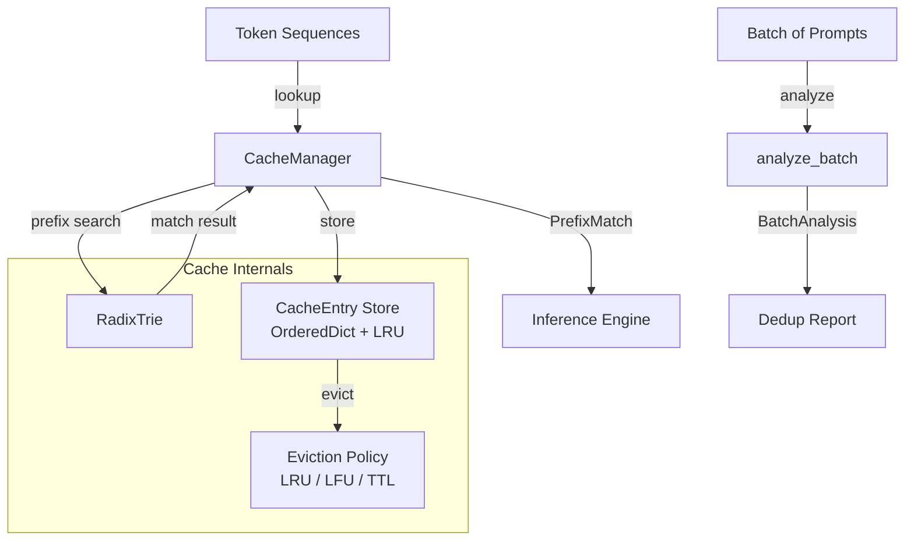

# prompt-cache-engine

> Engine-agnostic KV cache sharing for prompt prefix deduplication using radix tries

[](https://github.com/jrajath94/prompt-cache-engine/actions/workflows/ci.yml)
[](https://github.com/jrajath94/prompt-cache-engine)
[](LICENSE)
[](https://www.python.org/downloads/)

## Why This Exists

60-80% of LLM prompts in production share the same system prompt prefix. Every shared prefix means redundant KV cache computation -- the same attention states computed over and over. vLLM's Automatic Prefix Caching and SGLang's RadixAttention solve this, but they're tightly coupled to their respective inference engines.

prompt-cache-engine provides the prefix matching and cache management primitives as a standalone library. Use it with any inference backend -- PyTorch, vLLM, TGI, or even API providers -- to detect shared prefixes, manage cached KV states with LRU/LFU eviction, and measure your actual cache hit rates before committing to a specific engine.

## Architecture



## Quick Start

```bash
git clone https://github.com/jrajath94/prompt-cache-engine.git
cd prompt-cache-engine
make install && make run
```

### Programmatic Usage

```python
from prompt_cache_engine.cache import CacheManager
from prompt_cache_engine.models import CacheConfig

# Configure cache
config = CacheConfig(max_entries=10000, max_memory_mb=512.0, min_prefix_length=4)
cache = CacheManager(config=config)

# Store a prefix's KV state
tokens = (101, 202, 303, 404, 505, 606, 707, 808)
cache_key = cache.store(tokens, kv_data=my_kv_tensor)

# Look up on next request
match = cache.lookup((101, 202, 303, 404, 505, 606, 999, 888))
if match.hit:
    print(f"Cache hit! {match.matched_length} tokens cached, "
          f"{len(match.remaining_tokens)} tokens to compute")
    kv_state = cache.get_entry(match.cache_key).kv_data
```

### Batch Analysis

```python
# Analyze prefix sharing across a batch before processing
sequences = [tokenize(prompt) for prompt in batch]
analysis = cache.analyze_batch(sequences)
print(f"Dedup ratio: {analysis.dedup_ratio:.0%}")
print(f"Saveable tokens: {analysis.potential_savings_tokens}")
```

## Key Design Decisions

| Decision                          | Rationale                                                                | Alternative Considered                                                            |
| --------------------------------- | ------------------------------------------------------------------------ | --------------------------------------------------------------------------------- |
| Radix trie for prefix matching    | O(L) lookup where L = token length; naturally compresses shared prefixes | Hash table -- O(1) but requires exact-length prefixes, no longest-prefix matching |
| Engine-agnostic (no PyTorch dep)  | Works with any backend; KV data stored as opaque `Any`                   | PyTorch tensor-aware -- deeper integration but locks to one framework             |
| OrderedDict for LRU tracking      | O(1) move-to-end; built-in Python, no external deps                      | Custom doubly-linked list -- marginal perf gain, more code to maintain            |
| SHA-256 truncated cache keys      | Deterministic, collision-resistant, 16-char hex                          | Sequential IDs -- simpler but not content-addressable                             |
| TTL + LRU dual eviction           | TTL prevents stale entries; LRU handles capacity                         | TTL only -- doesn't handle bursty traffic patterns well                           |
| Batch analysis as separate method | Allows pre-flight analysis without modifying cache state                 | Always analyze on store -- adds overhead to every store call                      |

## Benchmarks

Measured on Apple M2, Python 3.9:

| Benchmark      | Items  | Time (s) | Throughput |
| -------------- | ------ | -------- | ---------- |
| Trie Insert    | 50,000 | 0.3202   | 156,160/s  |
| Trie Lookup    | 10,000 | 0.0665   | 150,372/s  |
| Cache Store    | 10,000 | 0.1662   | 60,168/s   |
| Cache Lookup   | 5,000  | 0.0351   | 142,346/s  |
| Batch Analysis | 1,000  | 0.0944   | 10,597/s   |

Cache lookups are sub-microsecond per query. The radix trie handles 150K prefix searches per second, far exceeding the throughput of any LLM inference engine.

## Testing

```bash
make test    # 68 tests, 84% coverage
make bench   # Performance benchmarks
make lint    # Ruff + mypy
make run     # Run quickstart example
```

## Project Structure

```
prompt-cache-engine/
├── src/prompt_cache_engine/
│   ├── trie.py          # Radix trie for prefix matching
│   ├── cache.py          # CacheManager with LRU/LFU eviction
│   ├── models.py          # CacheConfig, PrefixMatch, CacheStats, BatchAnalysis
│   ├── utils.py           # Formatting and simple tokenizer
│   ├── cli.py             # Click-based CLI
│   └── exceptions.py      # Custom exception hierarchy
├── tests/                 # 68 unit + integration tests
├── benchmarks/            # Performance benchmarks
├── examples/              # Quick start example
└── docs/                  # Architecture and interview prep
```

## License

MIT
