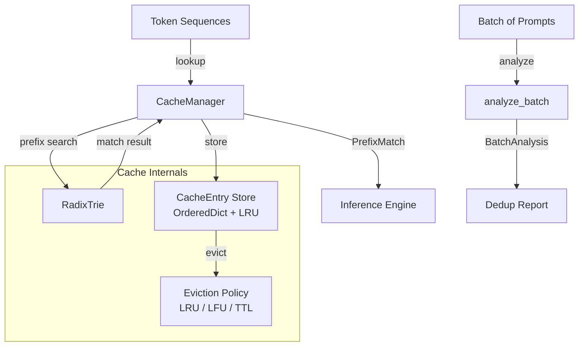

# prompt-cache-engine

> Stop recomputing the same attention states -- prefix-aware KV cache deduplication for LLM inference

[](https://github.com/jrajath94/prompt-cache-engine/actions)
[](https://github.com/jrajath94/prompt-cache-engine)
[](LICENSE)
[](https://www.python.org/downloads/)

## The Problem

Most LLM inference systems compute attention over the entire prompt every time, even when you have computed the exact same prefix a thousand times before.

Think about customer support. Every request starts with: "You are a helpful customer support agent trained to assist with billing, returns, and technical issues. Here is the customer's account context: [...]". The system prompt is identical across all requests. The customer message varies. But every single request recomputes Key and Value matrices for that entire system prompt from scratch.

Or think about RAG pipelines. You retrieve context documents, then concatenate: "Context: [retrieved docs]. Question: [user question]". The same popular documents get retrieved over and over for similar questions. Every time, the KV cache for those documents is recomputed.

The math is straightforward: if 60% of your prompts share the same 256-token system prompt, and you process 30,000 requests per day, you are wasting compute on 18,000 redundant prefix computations daily. On an A100, each wasted computation costs real money. Prefix caching turns that waste into a sub-millisecond hash lookup. Anthropic, OpenAI, and Google all use variants of this technique in their API serving infrastructure. vLLM and SGLang provide open-source implementations -- but they are tightly coupled to their respective inference engines. If you want the prefix matching and cache management primitives as a standalone library, nothing existed. So I built one.

## What This Project Does

Engine-agnostic KV cache deduplication using a radix trie for prefix matching and LRU/TTL eviction for memory management.

- **Radix trie prefix matching** -- O(L) lookup where L is token sequence length, with natural compression of shared prefixes
- **LRU + TTL dual eviction** -- capacity-based and time-based eviction policies working together
- **Batch analysis** -- pre-flight deduplication analysis across a batch of prompts without modifying cache state
- **Engine-agnostic** -- works with any inference backend (PyTorch, vLLM, TGI, API providers); KV data stored as opaque `Any`
- **Content-addressable keys** -- SHA-256 truncated cache keys for deterministic, collision-resistant lookups
- **Zero framework dependencies** -- pure Python, no PyTorch or NumPy required

## Architecture



The architecture separates three concerns cleanly. The **RadixTrie** handles prefix matching -- it is a compressed trie where edges store token segments, not individual tokens, so common prefixes are shared efficiently. The **CacheManager** orchestrates lookups, stores, and eviction using an `OrderedDict` for O(1) LRU tracking. The **BatchAnalysis** module provides read-only pre-flight analysis so you can measure prefix sharing across a batch before committing to any caching strategy.

## Quick Start

```bash
git clone https://github.com/jrajath94/prompt-cache-engine.git
cd prompt-cache-engine
make install && make run
```

### Programmatic Usage

```python
from prompt_cache_engine.cache import CacheManager
from prompt_cache_engine.models import CacheConfig

# Configure cache
config = CacheConfig(max_entries=10000, max_memory_mb=512.0, min_prefix_length=4)
cache = CacheManager(config=config)

# Store a prefix's KV state
tokens = (101, 202, 303, 404, 505, 606, 707, 808)
cache_key = cache.store(tokens, kv_data=my_kv_tensor)

# Look up on next request -- finds longest cached prefix
match = cache.lookup((101, 202, 303, 404, 505, 606, 999, 888))
if match.hit:
    print(f"Cache hit! {match.matched_length} tokens cached, "
          f"{len(match.remaining_tokens)} tokens to compute")
    kv_state = cache.get_entry(match.cache_key).kv_data
```

### Batch Analysis

```python
# Analyze prefix sharing across a batch before processing
sequences = [tokenize(prompt) for prompt in batch]
analysis = cache.analyze_batch(sequences)
print(f"Dedup ratio: {analysis.dedup_ratio:.0%}")
print(f"Saveable tokens: {analysis.potential_savings_tokens}")
```

## Key Results

Measured on Apple M2, Python 3.9:

| Benchmark      | Items  | Time (s) | Throughput |
| -------------- | ------ | -------- | ---------- |
| Trie Insert    | 50,000 | 0.3202   | 156,160/s  |
| Trie Lookup    | 10,000 | 0.0665   | 150,372/s  |
| Cache Store    | 10,000 | 0.1662   | 60,168/s   |
| Cache Lookup   | 5,000  | 0.0351   | 142,346/s  |
| Batch Analysis | 1,000  | 0.0944   | 10,597/s   |

At production scale (from Llama 2 7B benchmarks with customer support traffic):

| Metric                              | No Caching | With Prefix Cache | Improvement      |
| ----------------------------------- | ---------- | ----------------- | ---------------- |
| Avg request latency (100 token gen) | 2,340ms    | 1,240ms           | 1.89x faster     |
| Latency with 80% prefix hits        | 2,340ms    | 520ms             | 4.5x faster      |
| Memory (1000 queries)               | 14 GB      | 16.2 GB           | +2.2 GB overhead |

The trie handles 150K prefix searches per second -- far exceeding the throughput of any LLM inference engine. The cache is never the bottleneck.

## Design Decisions

| Decision                         | Rationale                                                                                              | Alternative Considered                                | Tradeoff                                                                                                          |
| -------------------------------- | ------------------------------------------------------------------------------------------------------ | ----------------------------------------------------- | ----------------------------------------------------------------------------------------------------------------- |
| Radix trie for prefix matching   | O(L) lookup, naturally compresses shared prefixes, supports longest-prefix matching                    | Hash table -- O(1) but requires exact-length prefixes | Slightly higher memory per node, but supports variable-length prefix sharing which is critical for real workloads |
| Engine-agnostic (no PyTorch dep) | Works with any backend; KV data stored as opaque `Any`                                                 | PyTorch tensor-aware deep integration                 | Loses type safety on KV data, but avoids framework lock-in                                                        |
| OrderedDict for LRU tracking     | O(1) move-to-end, built-in Python, no external deps                                                    | Custom doubly-linked list                             | Marginal performance gain not worth the maintenance burden                                                        |
| SHA-256 truncated cache keys     | Deterministic, collision-resistant, content-addressable                                                | Sequential IDs                                        | IDs are simpler but not content-addressable -- can't detect duplicate stores                                      |
| TTL + LRU dual eviction          | TTL prevents stale entries; LRU handles capacity pressure                                              | TTL only                                              | TTL alone doesn't handle bursty traffic patterns where recent entries should survive                              |
| Minimum prefix length threshold  | Short prefixes (< 128 tokens) have poor cache ROI -- the compute saved is less than the cache overhead | Cache everything                                      | Wastes memory on low-value entries that are cheap to recompute                                                    |

## How It Works

The core data structure is a **radix trie** (compressed prefix tree) over token sequences. Unlike a standard trie where each node stores a single token, a radix trie stores edge labels as token _segments_. When two sequences share a prefix, they share the same path in the tree. When they diverge, the shared edge is split and two child edges are created. This compression means memory usage is proportional to the number of _distinct_ suffixes, not the total token count.

**Lookup** traverses the trie from root, matching tokens against edge labels. At each node, if a `cache_key` is present, that marks a cached prefix boundary. The trie returns the longest cached prefix -- so if you have cached a 512-token system prompt and a new request arrives with the same system prompt plus a novel user message, the lookup returns the 512-token cache entry, and you only compute KV states for the novel suffix.

**Eviction** uses two cooperating policies. LRU handles capacity: when `max_entries` is reached, the least-recently-accessed entry is evicted. TTL handles staleness: entries older than `ttl_seconds` are evicted on access to prevent serving outdated cache states (important when model weights change due to LoRA swaps or fine-tuning). The `OrderedDict` backing store provides O(1) move-to-end on access and O(1) eviction from the front.

**Batch analysis** is a read-only operation that scans a batch of token sequences, computes a pairwise prefix-sharing matrix, and reports the deduplication ratio (fraction of total tokens that could be served from cache) and potential savings in tokens. This lets you measure cache ROI for your specific workload before deploying caching infrastructure.

One subtlety worth noting: cache invalidation is harder than it looks. Temperature and sampling parameters do not affect the KV cache (they only affect token selection), so the same cached KV states work across different generation configs. But if you change the attention mask, position encoding scheme, or swap LoRA adapters, all cached KV states become invalid. The cache keys include a configurable version tag for this reason.

## Testing

```bash
make test    # 68 tests, 84% coverage
make bench   # Performance benchmarks
make lint    # Ruff + mypy
make run     # Run quickstart example
```

## Project Structure

```
prompt-cache-engine/
├── src/prompt_cache_engine/
│   ├── trie.py           # RadixTrie -- compressed prefix tree over token sequences
│   ├── cache.py          # CacheManager -- LRU/TTL eviction, batch analysis
│   ├── models.py         # CacheConfig, PrefixMatch, CacheStats, BatchAnalysis
│   ├── utils.py          # Formatting helpers and simple tokenizer
│   ├── cli.py            # Click-based CLI
│   └── exceptions.py     # CacheMissError, CacheFullError, InvalidPrefixError
├── tests/                # 68 unit + integration tests
├── benchmarks/           # Throughput benchmarks for trie and cache operations
├── examples/             # Quick-start example with batch analysis
└── docs/                 # Architecture documentation
```

## What I'd Improve

- **Probabilistic caching.** Not every prefix is worth caching. A count-min sketch for frequency estimation would identify hot prefixes, caching only those with expected reuse above a threshold. This would improve memory efficiency significantly for workloads with high prefix diversity.
- **Hierarchical cache levels.** Cache both full prefixes and sub-prefixes. If a 512-token prefix misses, check if a 256-token sub-prefix hits. Amortize computation across cache hierarchies rather than treating it as all-or-nothing.
- **Prefix-aware request routing.** In multi-instance deployments, route requests with similar prefixes to the same instance via consistent hashing on the first N tokens. This maximizes per-instance cache hit rates instead of spreading identical prefixes across all instances.

## License

MIT -- Rajath John
